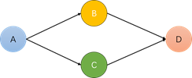
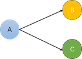
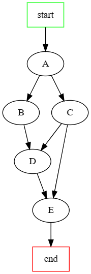

# dag-run
<p>A simple multi-task concurrent scheduling library，Multiple tasks with dependencies can be automatically scheduled to run concurrently according to their dependencies, minimizing the running time</p>

``` go get github.com/ycl2018/dag-run ```
## Feature
- <p>install `go get github.com/ycl2018/dag-run`</p>
- <p>Generic implementation, support go1.18</p>
- <p>Based on sync.WaitGroup, very simple and lightweight implementation</p>
- <p>Support fail fast, if a task returns an error during operation, the rest of the unrunning tasks will be canceled</p>
- <p>You can use TaskManager to easily register and get your Task tasks</p>
- <p>support add injector</p>

## 中文说明

一个简单的多任务并发调度工具，可以将具有依赖关系的多个任务，自动按其依赖关系并发调度运行

``` go get github.com/ycl2018/dag-run ```

特性：

- <p>支持泛型</p>
- <p>基于sync.WaitGroup，非常简单、轻量的实现</p>
- <p>支持fail fast，运行中如果有任务返回错误，则取消其余未运行任务</p>
- <p>可以使用TaskManager来方便的注册和获取你的Task任务</p>
- <p>支持提交函数任务/结构体任务</p>
- <p>支持注入injector，在每个任务执行前后插入通用的业务逻辑，如打点、监控等</p>

## Example1：函数任务
 
 
 这个例子中，任务B、C依赖A任务的完成、任务D依赖B、C任务的完成。任一任务返回错误，执行将会提前终止。
```Go
err := dagRun.NewFuncScheduler().
		Submit("A", a). /* 参数： 名称，任务函数，依赖 */
		Submit("B", b, "A").
		Submit("C", c, "A").
		Submit("D", d, "B", "C").
		Run()

var a = func() error {return nil}
var b = func() error {return nil}
var c = func() error {return nil}
var d = func() error {return nil}

// 支持使用 SubmitWithOps 来设置任务的重试次数和超时时间
SubmitWithOps("A", a, []TaskOption{Retry(3),Timeout(3*time.Second)})
```
## Example2：对象任务


实际业务场景下，任务的执行通常会在一个确定的执行环境中，如提供任务入参、任务配置、收集任务结果等。你可以通过实现Task接口来定义你的任务，其中的泛型参数T即为任务环境参数。

```Go
type Task[T any] interface {
	Name() string
	Dependencies() []string
	Execute(context.Context, T) error
	Options() []TaskOption
}
```

本例展示任务在执行环境参数sync.Map下的使用场景。



```Go

type taskA struct{NoOptionTask}
func (ta taskA) Name() string {return "A"}
func (ta taskA) Dependencies() []string {return nil}
func (ta taskA) Execute(ctx context.Context, runCtx *sync.Map) error {return nil}

type taskB struct{NoOptionTask}
func (tb taskB) Name() string {return "B"}
func (tb taskB) Dependencies() []string {return []string{"A"}}
func (tb taskB) Execute(ctx context.Context, runCtx *sync.Map) error {return nil}

type taskC struct{NoOptionTask}
func (tc taskC) Name() string {return "C"}
func (tc taskC) Dependencies() []string {return []string{"A"}}
func (tc taskC) Execute(ctx context.Context, runCtx *sync.Map) error {return nil}

type NoOptionTask struct{}
func (n NoOptionTask) Options() []dagRun.TaskOption {return nil}

ds := NewScheduler[*sync.Map]()
ds.Submit(taskA{})
ds.Submit(taskB{})
ds.Submit(taskC{})
err := ds.Run(context.Background(), &sync.Map{})
```

## 拦截器
支持自定义拦截器工厂，为每个任务生成一个拦截器，以便在其执行前后做一些前置/后置处理。

拦截器和拦截器工厂接口定义

```Go
type Injector[T any] struct {
	Pre   func(ctx context.Context, runCtx T) error
	After func(ctx context.Context, runCtx T, err error) error
}

type InjectorFactory[T any] interface {
	Inject(ctx context.Context, task Task[T]) Injector[T]
}

type InjectorFactoryFunc[T any] func(ctx context.Context, task Task[T]) Injector[T]

func (i InjectorFactoryFunc[T]) Inject(ctx context.Context, task Task[T]) Injector[T] {
	return i(ctx, task)
}
```
比如在每个任务执行前后打印日志的自定义拦截器工厂实现

```Go
ds = ds.WithInjectorFactory(InjectorFactoryFunc[*sync.Map](func(ctx context.Context, task Task[*sync.Map]) Injector[*sync.Map] {
		return Injector[*sync.Map]{
			// 任务执行前
			Pre: func(ctx context.Context, runCtx *sync.Map) error {
				log.Printf("task:%s start at:%s\n", task.Name(), time.Now())
                return nil
			},
			// 任务执行后
			After: func(ctx context.Context, runCtx *sync.Map, err error) error {
				log.Printf("task:%s end at:%s\n", task.Name(), time.Now())
				return err
			},
		}
	}))
```

## Dump为DOT语言

支持将构建的任务有向图转换为dot语言显示

```Go
dotStr := dagRun.NewFuncScheduler().
		Submit("A", a).
		Submit("B", b, "A").
		Submit("C", c, "A").
		Submit("D", d, "B", "C").
		Submit("E", e, "C", "D").
		Dot()

println(dotStr)

// digraph G {
// "start"[shape=box,color="green"]
// "end"[shape=box,color="red"]
// "A" -> {"B","C"}
// "B" -> {"D"}
// "C" -> {"D","E"}
// "D" -> {"E"}
// "start" -> {"A"}
// {"E"}  -> "end"
// }
```
将打印转换为图形：
<p align="center">

</p>